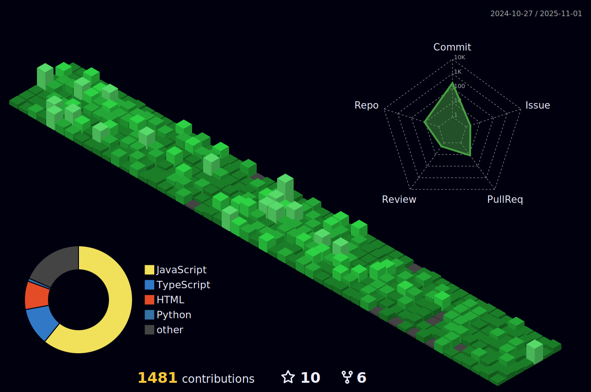

<!--Top Banner starts -->
<!-- 

 -->

<!--Top Banner ends -->

<h1 align="center">Hi, I'm Devi Prasad</h1>
<!-- <h3 align="center">A passionate Software developer from India</h3> -->

  
 

<!--Profile views starts -->
 
  
 
<!-- 
 
  Views  
  

 -->
<!--Profile views ends -->

  

<!-- About me starts -->

<h3 align="left">About me </h3>

- 🔭 I’m currently working at <b>Novel Office</b>

<!-- - 🌱 I’m currently learning **Next JS** -->

<!-- - 🤝 I’m looking for new role **Frontend Developer, React js Developer** -->

- 👨‍💻 All of my projects are available at [here](https://deviprasadkl.github.io/Portfolio/)

- 📫 You can reach me here **deviprasadofficial@gmail.com**

- 📄 Know about my experiences [here](https://drive.google.com/file/d/1x9YHOyE09IlToDHS_vu6XRaRbPwe74V5/view?usp=sharing)

<!-- About me ends -->

<!-- Languages and Tools starts -->

<h3 align="left">Languages and Tools </h3>

  

  
<!--       
    
    
    
    
    
    
    
     
    
    
    
     
    
    
     
    
    
    
     
    
    
    
    
    
     
     -->

<!-- Languages and Tools ends -->

<!-- Git hub activity starts -->

<h2>Github Stats and Activity </h2>

 
  

&nbsp;

 
<!-- Git hub activity ends -->

<!-- Connect with me starts -->

<h3 align="left">Connect with me </h3>

    
    
<!--   
   -->

<!-- Connect with me ends -->

<!-- 3D Commits graph starts -->

<!-- 3D Commits graph ends-->

<!-- Graph starts -->

  

<!-- Graph ends -->

<!--Snake Game start-->
<!--

   -->
<!--Snake Game end -->
